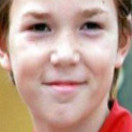
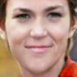
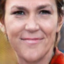
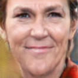
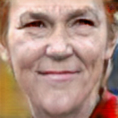
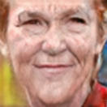

## Abstract

This project addresses the modeling and simulation of progressive changes over time, such as human face aging. By treating the age phases as a sequence of image domains, we construct a chain of transformers that map images from one age domain to the next. Leveraging recent adversarial image translation methods, our approach requires no training samples of the same individual at different ages. Here, the model must be flexible enough to translate a child face to a young adult, and all the way through the adulthood to old age. We find that some transformers in the chain can be recursively applied on their own output to cover multiple phases, compressing the chain. The structure of the chain also unearths information about the underlying physical process. We demonstrate the performance of our method with precise and intuitive metrics, and visually match with the face aging state-of-the-art.

## Paper

[Paper preprint](https://arxiv.org/abs/1802.05023)

## Examples

A partially-recursive transformation sequence for transforming an approximately 15-year-old to 65-year-old.
The double-trained 25→35 transformer is applied also to 35→45 transformation.








## Source code

[Source code and utilities on GitHub](https://github.com/AaltoVision/img-transformer-chain)

## Referencing

```
@inproceedings{Heljakka+Solin+Kannala:2018,
      title = {Recursive Chaining of Reversible Image-to-image Translators For Face Aging},
     author = {Heljakka, Ari and Solin, Arno
               and Kannala, Juho},
       year = {2018},
  booktitle = {Proceedings of Advanced Concepts for Intelligent Vision Systems }
}
```
